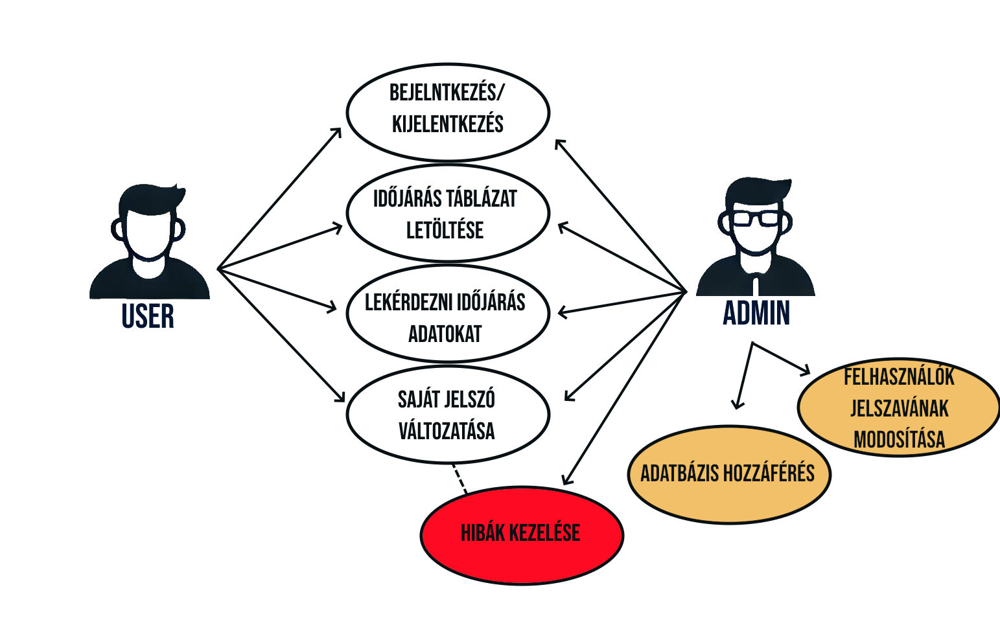
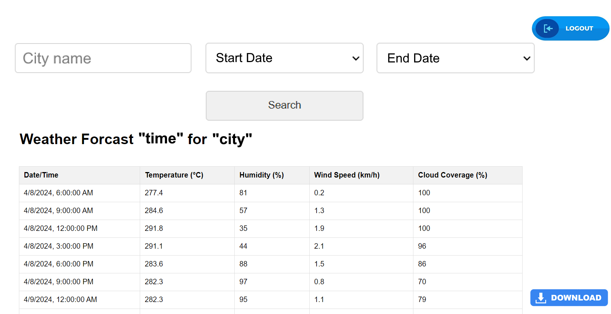

# Rendszerterv

## 1. A rendszer célja
A FarmCrop Technologies célja egy olyan webes alkalmazás fejlesztése, amely valós idejű és történelmi időjárási adatokat biztosít a mezőgazdasági vállalkozások számára. A rendszer középpontjában a precíziós gazdálkodás támogatása áll, amelyhez elengedhetetlen az időjárási tényezők folyamatos figyelése. A gazdák számára az időjárási adatokhoz való azonnali hozzáférés lehetőséget teremt a döntéshozatal optimalizálására, a termelékenység növelésére és a kockázatok csökkentésére.

A rendszernek képesnek kell lennie arra, hogy valós idejű adatokat jelenítsen meg hőmérséklet, páratartalom, csapadék és szélsebesség tekintetében, valamint hosszabb távú előrejelzéseket adjon. A történelmi adatokkal történő elemzés lehetőséget ad a múltbéli időjárási események megismerésére, ami fontos a termények időbeli viselkedésének megértésében. A rendszernek továbbá könnyen kezelhetőnek kell lennie, reszponzívnak, és különböző eszközökön is működnie kell, beleértve az okostelefonokat és táblagépeket.

## 2. Projektterv
A projektterv célja, hogy három hét alatt elkészüljön a webes időjárási alkalmazás. A projektet négy csapattagra osztják, két frontend és két backend fejlesztővel. A backend fejlesztők felelősek az időjárási API-k integrációjáért és a történelmi adatok feldolgozásáért, míg a frontend fejlesztők a felhasználói felületért, valamint a reszponzív dizájn megvalósításáért.

A munka négy fő fázisból áll: követelményelemzés, tervezés, fejlesztés és tesztelés. Az első hét során az üzleti követelményeket és technikai specifikációkat pontosítják, a második hét a fejlesztés időszaka, a harmadik hét pedig a tesztelésé és az esetleges hibajavításoké. Minden csapattag feladata legalább 100-200 sor kód megírása, valamint unit tesztek fejlesztése a saját komponenseihez. A projekt sikeres lezárásához szükség van rendszeres státuszjelentésekre és közös tesztelési fázisokra.

### **Projektmunkások és felelőségek:**
#### **Backend munkálatok:** Kolozsi Márton
Feldata A háttérfolyamatokat létrehozni
#### **Frontend munkálatok:** Délczeg Sándor Balázs
Feladata a frontend kialakítása
#### **Full stack:** Horog Gabriella, Horog Regina
Feladatuk a háttérfolyamatok összekötése a kinézettel, adatbázis összekötése a frontendel

### **Ütemterv:**
| Funckió                   | Feladat                       | Prioritás |
|---------------------------|-------------------------------|-----------|
| Követelmény specifikáció  |                               | 0         |
| Funkcionális specifikáció |                               | 0         |
| Rendszerterv              |                               | 0         |
| Visual Crossing           | API kulcs lekérése            | 1         |
| Model                     | Python script megírása        | 2         |
| Model                     | Segéd osztályok megírása      | 2         |
| Felhasználói felület      | Kezdő képernyő kialakítása    | 2         |
| Felhasználói felület      | Fő képernyő kialakítása       | 2         |
| Adatbázis                 | Admin felhasználó elkészítése | 3         |
| Felhasználói felület      | Reszponzivitás                | 3         |
| Letöltés                  | CSV formátumba exportálás     | 4         |

## 3. Üzleti folyamatok modellje

## 4. Követelmények
#### - Funkcionális követelmények:
- Bejelentkező felület
- Felhasználók adatainak tárolása.
- A rendszer valós adatokat kell szolgáljon
- Kereső biztosítása, melyben adott városra lehet szűrni
- Táblázatszerűen mutatni az adott város hőmérsékletét, csapadék mennyiségét, páratartalmát és szélsebességét
- A felhasználók számára lehetőséget kell biztosítani előrejelzések lekérdezésére (napi, heti, havi)
- Történelmi időjárási adatokhoz való hozzáférés, amelyek legalább az elmúlt öt évet lefedik
- CSV állomány exportálása/letöltése, amely tartalmazza az adott város időjárás adatait
- Reszponzivitás, hogy különböző eszközökön (mobil, tablet, PC) egyaránt jól működjön

#### - Nem funkcionális követelmények:
- A felhasználók nem juthatnak hozzá más felhasználók személyes adataihoz a nevükön és azonosítóikon kívül.

#### - Törvényi előírások, szabványok:
- GDPR-nek való megfelelés

## 5. Funkcionális terv
### Rendszerszereplők:
- Admin
- Felhasználó

### Rendszerhasználati esetek és lefutásaik:
#### ● ADMIN:
- Teljes hozzáférése van a rendszerhez
- A felhasználói adatokat látják, változtathatják
- Felhasználó hozzáadására, törlésére van lehetőségük
- Képes lekérdezni az időjárás adatokat
- Le tudja tölteni az időjárás táblázatát

#### ● Felhasználó
- Képes lekérdezni az időjárás adatokat
- Le tudja tölteni az időjárás táblázatát

### Menü-hierarchiák:
#### ● BEJELENTKEZÉS
- Bejelentkezési felület
#### ● MAIN MENÜ
- Időjárás lekérdezés
- Táblázat, mely tartalmazza a keresés adatait
- Táblázat letöltés
- Új felhasználó hozzáadása (Admin)
- Kijelentkezés

### Képernyőtervek
##### BEJELENTKEZÉS

##### MAIN MENÜ

## 6. Architekturális terv
Az alkalmazás háromrétegű architektúrát követ, amely elválasztja az adatfeldolgozási logikát a felhasználói interfésztől. 

### - Az első réteg a prezentációs réteg:  
- A felhasználók interakcióba lépnek az alkalmazással. 
- Ez a réteg a reszponzív felhasználói felületet tartalmazza.
- HTML, CSS és JavaScript alapú.
- Backend szolgáltatásokkal REST API-kon keresztül kommunikál.
### - A második réteg az alkalmazási logika réteg:
- Felelős az üzleti szabályok és funkciók végrehajtásáért. 
- Ez a réteg Java vagy Python alapú.
- Integrálódik az időjárási szolgáltatások API-jaival. 
### - A harmadik réteg az adatbázis réteg: 
- Biztosítja a történelmi és valós idejű adatok tárolását. 
- Az adatbázis relációs adatbáziskezelő rendszert MySQL-t használ.
- Lehetővé teszi az adatok gyors keresését és elemzését.

